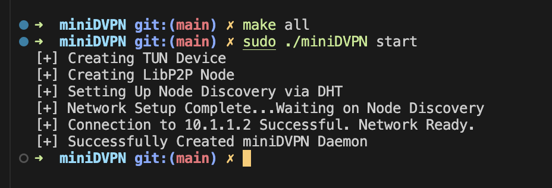
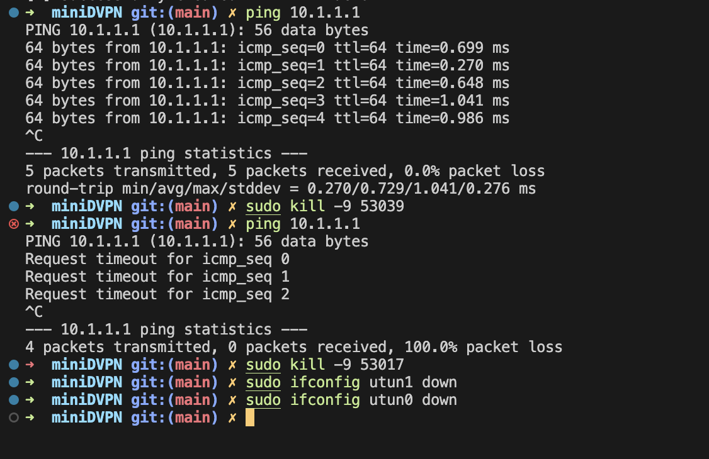

# 一个mini去中心化VPN实现

1. 第一步：基于libp2p和tun/tap虚拟网卡建立一个简易的VPN服务

2. 第二步：p2p -> blockchain (blockchain做简单的节点发现，ip分发)，在这步结束后 blockchain内部的节点应该会建立起一个内部网络，有一个节点可以通过加入区块链来参与内部隧道的传输。

---
到这一步，用户其实就可以通过加入区块链来参与隧道了。

区块链起到什么作用呢？维护相同的状态（当前网络内部全部节点的互联）

---

3. 第三步（可选）：需要让区块链进行能够进行编程，（或者存储一部分用户信息） 身份验证? blockchain -> 完全替代VPN Server，用户可以拥有自己的客户端，与区块链进行交互，选择代理节点，需要在链上记录一些信息 or (智能合约)


## 使用方式

使用前请确保安装了go

```go
go mod tidy
```

```bash
make all
```

```bash
./miniDVPN
```


## 第一步完成后的效果

```bash
make all
./miniDVPN init
./miniDVPN init -i peer1 -p 8080 -a 10.1.1.2/24
```

得到两个yaml文件

```yaml
interface:
    name: peer0
    id: 12D3KooWBgRtfAqF1cXfY4VL1xabobms4bWgzgGrTdCgFuYJAi4w
    listen_port: 8080
    address: 10.1.1.1/24
    private_key: !!binary |
        CAESQH3fD1GTOlFzts2Ygh0rqijXbnB+cITds8eyGnEOsG5IG67vxZcRyxCwvCK0+DaQhK
        3a7e4tttZsRlucgGZnkIA=
peers: 
    10.1.1.2:
        id: 12D3KooWE28dPSYozL2Y3fv6RvTXTW1bCJS3n9zhAuG9uuXiYJkB

```

修改peers后，在两个terminal中执行命令

```bash
sudo ./miniDVPN start

sudo ./miniDVPN start -i peer1
```

启动之后可以发现节点


同时可以ping通，把对应的tun设备关掉后，就ping不通内部节点了（没有转发服务了）




## 参考

https://github.com/hyprspace/hyprspace

https://github.com/balena/go-libp2p-vpn